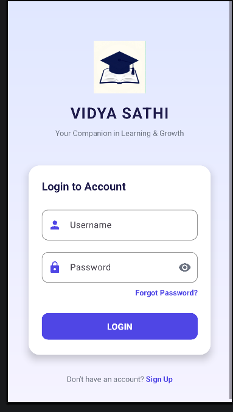
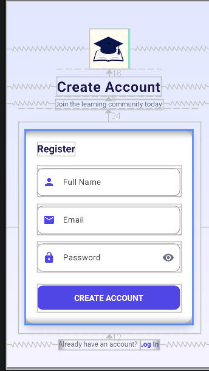

# Vidya Sathi - Educational App

Vidya Sathi is a modern and premium Android application designed to accompany students in their learning and growth. The project currently features high-fidelity, beautifully-styled user interfaces (UI) and local user authentication flows.

## Screenshots

| Login Screen | Signup Screen |
| :---: | :---: |
|  |  |

---

## Current App Flow & Screens

The application is structured using a responsive `RelativeLayout` and scroll-view architecture, styled with a sophisticated indigo and violet color palette.

### 1. Login Screen (`activity_main.xml` & `MainActivity.java`)
- **Visual Design**: Sleek background gradient, centered app logo, and a rounded card containing the login fields.
- **Input Fields**: Features Material 3 floating hint inputs (`TextInputLayout` / `TextInputEditText`) with clean outlines, prefix icons, and password-visibility toggle.
- **Authentication**: Validates credentials against a hardcoded administrator account (`manpreet||admin` / `1`) or user accounts registered dynamically. The input checks are case-insensitive to ensure a smooth keyboard experience.
- **Navigation**: Directly redirects to the Signup registration screen or launches the Educational Dashboard upon successful credentials check.

### 2. Signup / Registration Screen (`activity_signup.xml` & `SignupActivity.java`)
- **Dynamic Local Storage**: Saves user registration details (Full Name, Email, Password) securely on the device using Android's `SharedPreferences`.
- **UI Styling**: Seamlessly matches the login aesthetic with customized vector icons for user names, emails, and passwords.
- **Validation**: Ensures that all inputs are filled before proceeding to login.

### 3. Educational Dashboard (`mainui.xml` & `MainUiActivity.java`)
Once logged in, the user enters a highly-polished dashboard preview representing a learning portal:
- **Personalized Header**: Greets the user dynamically by displaying the exact name they registered with (e.g., *"Welcome Back, Rahul Sharma"*).
- **Search Bar**: A rounded card search bar to find chapters, courses, or notes.
- **Course Progression**: A dedicated "Continue Learning" widget displaying the current course ("Android App Development Basics"), instructor details, a play control trigger, and a visual progress bar indicating **65% completion**.
- **Interactive Subjects**: A horizontal scroll list of subject categories (Maths, Physics, Coding) accompanied by colored icons.
- **Recommendations**: Displays "Recommended for You" cards (e.g., Machine Learning Crash Course) showing lecture counts and rating benchmarks.

---

## Tech Stack & Architecture

- **Platform**: Android SDK (Target API Level 36, Min SDK 23)
- **Programming Language**: Java
- **Layout System**: XML (RelativeLayout, ScrollView, Nested Constraint/Linear components)
- **UI Components**: Google Material Design 3 Components (`TextInputLayout`, `MaterialButton`, `CardView`)
- **Data Persistence**: SharedPreferences (for lightweight local database simulation)

---

## How to Run & Test

1. Clone or download this repository.
2. Open the project folder in **Android Studio**.
3. Rebuild the project (`Build > Rebuild Project`) to index assets.
4. Click the green **Run** button to install it on a connected mobile device or emulator.
5. Create a new user in the *Sign Up* screen, then use those credentials to log into the *Dashboard*!
